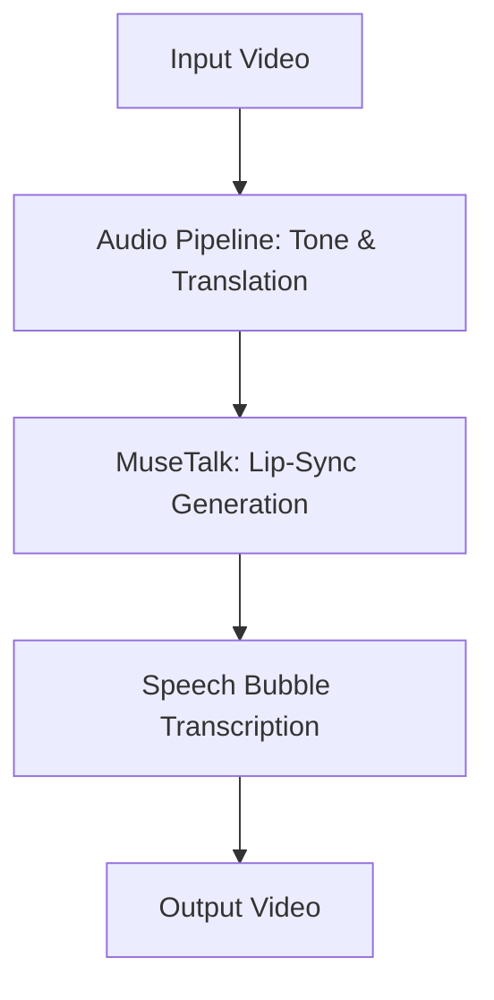

# Video Translation and Vocal Tone Preservation Pipeline

This repository is the ACM AI Spring 2026 Project. The pipeline translates spoken-English video into Spanish (or vice versa) while preserving the speaker's vocal tone and synchronizing the video's lip movements using MuseTalk.

## Project Structure
The repository consists of three main components:
1. **`audio_pipeline/`** — Handles speech transcripts, translation (English to Spanish, Spanish to English), and vocal tone analysis/classification.
2. **`MuseTalk/`** — A high-fidelity real-time lip-syncing model (supporting versions 1.0 and 1.5) that synchronizes the output video's mouth movements with the translated audio.
3. **`speech_bubble_transcription/`** — Transcribes/translates video audio using OpenAI Whisper, tracks the speaker's face using MediaPipe, and overlays styled, animated tracking speech bubbles.

---

## 📐 Technical Architecture & Workflow

The orchestration pipeline coordinates three core stages to translate, lip-sync, and subtitle the target video. The pipeline workflow is structured as follows:



---

### 1. Audio Pipeline (`audio_pipeline/`)
The audio pipeline is responsible for transcription, translation, voice cloning, and speech emotion recognition.

* **Syllable-Matching Translation**: 
  * *How it works*: The input video's Spanish speech is transcribed using **OpenAI Whisper**. The transcribed text is translated into English using the **`Helsinki-NLP/opus-mt-en-es`** transformer model. The pipeline counts the syllables of the Spanish source and compares them against 10 generated English candidate translations (produced via beam search). It selects the candidate with the closest syllable count and, if needed, swaps words with synonyms using NLTK and the Open Multilingual WordNet to fine-tune the match.
  * *Design Rationale*: If a translated phrase is much shorter or longer than the original Spanish phrase, the lip-syncing looks highly unnatural (either the mouth moves too fast or stops moving before the audio ends). Matching syllable counts ensures that the spoken duration of the translated English audio matches the timing of the original video.
* **Vocal Tone Preservation (OpenVoice)**:
  * *How it works*: It extracts a voice reference embedding from the original Spanish speaker. An English TTS engine generates a base English voice recording of the translated text, and OpenVoice's zero-shot voice cloning applies the extracted speaker identity onto the generated English audio.
  * *Design Rationale*: Preserving the original speaker's vocal tone (rather than using a generic voice actor) maintains their unique vocal identity, making the translated video feel authentic and immersive.
* **Local Speech Emotion Recognition (SER)**:
  * *How it works*: The pipeline resamples the audio segments to 16 kHz mono and uses the Hugging Face **`superb/hubert-large-superb-er`** model to classify vocal emotion into four primary classes: *neutral, happy, angry, sad*.
  * *Design Rationale*: This replaces legacy web-based sentiment APIs (like MeaningCloud), allowing the entire pipeline to run locally on CPU/GPU without internet access or external API keys. It also generates emotional metadata that can be used to influence TTS vocal inflections or dynamically style speech bubble colors.

---

### 2. Lip-Syncing (`MuseTalk/`)
This component synchronizes the mouth movements of the speaker in the video with the newly generated English audio.

* **High-Fidelity Syncing**:
  * *How it works*: MuseTalk is a real-time, latent-diffusion lip-syncing model (v1.5). It is conditioned on audio features extracted by a Whisper encoder and synchronizes the mouth region by editing the latent space of a pre-trained VAE.
  * *Design Rationale*: We chose MuseTalk over older models like Wav2Lip because Wav2Lip frequently generates blurry, low-resolution mouth overlays and loses teeth/lip details. MuseTalk maintains high-fidelity textures and blends naturally with the rest of the face.
* **Face Alignment & Margin Tuning**:
  * *How it works*: Configures bounding box shifts (`bbox_shift`) and extra vertical padding margin (`extra_margin`).
  * *Design Rationale*: During wide mouth movements or expressions, standard face detection boxes can crop out parts of the chin or jawline, creating visible blending borders. Modifying the vertical crop boundary prevents these artifacts.
* **Unified Face Crop & Super-Resolution (`--crop-upscale`)**:
  * *How it works*: If enabled, **MTCNN** detects facial coordinates across sampled frames to define a single, unified Region of Interest (ROI) for the face. The script crops the face region, upscales it by $4\times$ using the **FSRCNN** super-resolution model (with Lanczos4 interpolation as a fallback), runs MuseTalk inference on this high-res crop, and downscales the final frame back onto the original video.
  * *Design Rationale*: In full-body or medium-shot videos, the face occupies a small percentage of pixels. Direct lip-syncing yields a pixelated mouth. Moving face ROIs between frames also causes rendering jitter. Establishing a unified ROI and upscaling the face crop ensures that the lips remain sharp and high-definition without flickering or boundary lines.

---

### 3. Speech Bubble Subtitles (`speech_bubble_transcription/`)
This component tracks the speaker and overlays animated, comic-style speech bubbles.

* **Speaker Feature Tracking**:
  * *How it works*: Uses **MediaPipe Face Landmarker** to track the 3D landmark coordinates of the speaker's nose frame-by-frame.
  * *Design Rationale*: We track the nose because it acts as the stable center of the face, keeping the speech bubble anchored relative to head tilts and movements.
* **Jitter Control (Deadzone & Low-pass Filters)**:
  * *How it works*: Applies a deadzone filter that ignores minor movements below 8 pixels, coupled with a low-pass filter (smoothing factor `0.08`).
  * *Design Rationale*: Raw face tracking is subject to subtle high-frequency coordinate noise, which makes overlaid elements shake. The deadzone and low-pass filter smooth out this micro-jitter, making the bubble float naturally.
* **Comic-Style Subtitles**:
  * *How it works*: Whispers the audio to extract text and timestamps, wraps the text within a specified width, and draws animated speech bubbles that point directly to the speaker's face.
  * *Design Rationale*: Standard bottom-of-screen subtitles can feel detached from the speaker, particularly when there are multiple people. Positioning bubbles directly next to the speaker makes the dialogue attribution intuitive and gives the video a premium, dynamic look.

---

## 🛠️ Setup Instructions

### 1. Pre-requisites
- **Operating System:** Linux with GPU (CUDA support).
- **FFmpeg** installed and accessible in your system PATH.
- **Python 3.10+** (either in your base Conda environment or any active environment).

### 2. Install Dependencies
You can install all dependencies directly into your current active/base environment:

```bash
# 1. Install PyTorch with CUDA 11.8 support
pip install torch==2.0.1 torchvision==0.15.2 torchaudio==2.0.2 --index-url https://download.pytorch.org/whl/cu118

# 2. Install MuseTalk requirements
pip install -r MuseTalk/requirements.txt

# 3. Install MMLab Ecosystem
pip install --no-cache-dir -U openmim
mim install mmengine "mmcv==2.0.1" "mmdet==3.1.0" "mmpose==1.1.0"

# 4. Install audio pipeline and speech bubble requirements
pip install -r speech_bubble_transcription/requirements.txt
pip install pyphen nltk sentencepiece sacremoses transformers scipy pandas soundfile
```

> [!IMPORTANT]
> The dependencies require `huggingface-hub` to be strictly within `<1.0, >=0.19.3` due to a transformers constraint. The setup will pin and run with `huggingface-hub==0.36.2` to ensure compatibility.

### 3. Download Model Weights
Navigate to the `MuseTalk/` directory and run the weight downloader:
```bash
cd MuseTalk
bash download_weights.sh
cd ..
```
This script downloads all required model weights (MuseTalk/MuseTalk v1.5, StabilityAI's sd-vae, Whisper, DWPose, etc.) into `MuseTalk/models/`.

---

## 🚀 Running Inference
To run a test lip-syncing task directly:

```bash
cd MuseTalk
bash inference.sh v1.5 normal
cd ..
```

This runs inference using the configuration at `MuseTalk/configs/inference/test.yaml`.

---

## 🔄 End-to-End Spanish to English Translation & Lip-Sync Pipeline
We provide a master orchestration script `run_pipeline.sh` at the top level of the repository. This script takes an input video containing Spanish speech, translates the speech to English, clones the speaker's vocal tone to generate the English audio, runs MuseTalk to produce a lip-synced video, and optionally overlays tracking speech bubbles.

### Usage
From the root of the repository, execute:
```bash
./run_pipeline.sh <input_spanish_video> <output_synced_video> [options]
```

### Options
* `--speech-bubble`: Transcribes the final lip-synced video using OpenAI Whisper, tracks the speaker's face, and overlays styled, animated tracking speech bubbles.
* `--crop-upscale`: Crops the speaker's face region, upscales it using super-resolution (FSRCNN) or Lanczos4 scaling, and pastes it back onto the original frame post-inference for higher resolution mouth movements.

**Example with all options enabled:**
```bash
./run_pipeline.sh Video1.mp4 results/output_video_with_bubbles.mp4 --speech-bubble --crop-upscale
```

This script automatically:
1. Activates the `audio_pipeline` Conda environment to run transcription, translation, and OpenVoice cloning.
2. Stages the files and generates a temporary config for MuseTalk.
3. Activates the `MuseTalk` Conda environment to run the lip-sync generation (with crop/upscale if enabled).
4. Runs the speech bubble overlay generator inside the `speech_bubble` Conda environment (if enabled).
5. Copies the final video to the destination path and cleans up all intermediate temporary files.

---

## 💬 Standalone Speech Bubble Overlay
If you already have a lip-synced video (or want to add subtitles to any video) and want to overlay tracking speech bubbles without running the entire translation and lip-sync pipeline, you can use the standalone wrapper script:

### Usage
```bash
./overlay_speech_bubble.sh -i <input_video> -o <output_video> [options]
```

**Example:**
```bash
./overlay_speech_bubble.sh -i results/output_video.mp4 -o results/output_video_with_bubbles.mp4 --task transcribe --model medium
```

### Options
* `-i`, `--input` (Required): Path to the input video.
* `-o`, `--output` (Default: `results/output_video_with_bubbles.mp4`): Path for the output video.
* `-a`, `--audio`: Custom audio track to merge (e.g. translated/cloned audio).
* `--task` (Default: `translate`): Whisper task (`translate` to translate Spanish to English text, or `transcribe` to transcribe matching audio).
* `--model` (Default: `medium`): Whisper model size (`tiny`, `base`, `small`, `medium`, `large`).
* See [speech_bubble_transcription/README.md](speech_bubble_transcription/README.md) for more customization options (such as bubble colors, font scales, tracking parameters, offsets, and deadzones).

---

## 🎥 Demo Videos
* **Original Spanish Video:** [Video1.mp4](Video1.mp4)
* **Final Synced & Bubble-Overlay Video:** [results/output_video_with_bubbles.mp4](results/output_video_with_bubbles.mp4)
